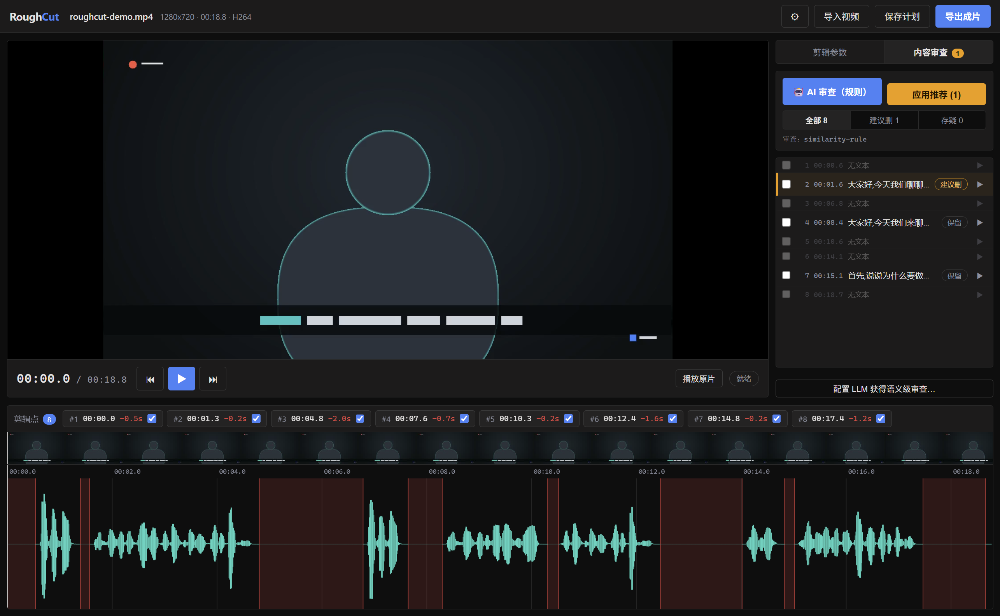

# RoughCut · 粗剪

**口播视频一键粗剪。**自动检测每一处停顿，把它们统一收紧到你指定的间隔（0.2 秒 / 0.3 秒 / 0.5 秒，节奏由你定）；逐切点试听衔接、不导出就能整片预览，满意再导出。收工。

[](LICENSE)
[](https://nodejs.org)
[-0078d4.svg)](#桌面端)
[](#命令行)

[English docs →](README.md)




## 为什么做这个

用提词器录口播，停顿注定长短不一：有的短、有的长、有的是"脑子当机"的两三秒。剪映等工具的智能剪辑对语音间隔识别不准，也没法精确控制剪完的间隔时长——最后还是得盯着波形一刀一刀剪，五分钟素材几十上百个停顿，纯体力活。

RoughCut 只做一件事并做准：**让口播里每一处停顿变成你想要的精确时长**，直接基于音频波形完成。导出的成片作为新的原始素材进剪映做二次创作（字幕、BGM、调色）。

## 功能与路线图

### ✅ 已完成

**粗剪核心（v0.1）**
- ⚡ 一键收紧停顿——RMS 能量检测，长于目标间隔的停顿精确收缩到目标值，保留的间隔全是原片底噪
- 🎛️ 节奏参数化——目标间隔 / 最小停顿 / 静音阈值 / 段首段尾保留，拖动滑块即时重算
- 👂 导出前试听——逐切点听"剪完后的衔接"（前后各 1.2 秒）；**无需导出**即可整片无缝紧凑预览（Web Audio 采样级拼接）
- ✅ 切点可否决——单独取消勾选任一切点，其余自动重算
- 📤 干净导出——H.264 MP4（CRF 可调）+ 可选纯音频 WAV + 记录每一刀的 JSON 剪辑报告
- 🖥️ GUI + 命令行共用一套引擎与同一份计划 JSON 契约（完全离线、无云端）

**预览引擎（v0.1.x）**
- 🎞️ 剪映式即时预览——点哪看哪：缩略图层先答话、高清帧随后盖上；波形上方胶片条跟随缩放
- 🚀 4K / HEVC 友好——硬解探测直播原片、秒级 seek 的低清代理（带进度），导出始终用原片

**转录与 AI 审查（v0.2）**
- 📝 whisper.cpp 本地转录，按检测出的语音段对齐
- 🤖 AI 标出重说草稿 / 重复 / 表达欠佳段——任意 OpenAI 兼容大模型（DeepSeek / 通义 / Ollama 等），未配置时本地相似度规则零配置兜底
- 🗑️ 一键应用推荐：被删段与两侧停顿合并收缩、衔接仍精确等于目标间隔；紧凑审查列表带过滤与逐段试听

### ⬜ 计划中

- 自适应静音阈值（免手调 dB）
- NVENC / QSV 硬件编码导出
- 批量队列处理（多文件）
- 导出剪映草稿工程（可行性调研）
- Windows 安装包分发（目前源码运行）
- macOS / Linux GUI 验证（CLI 已跨平台）
- 切点边界拖拽微调、更多键盘快捷键（JKL）
- 超长素材（>30 分钟）波形渲染优化

更细粒度的开发看板见 [docs/STATUS.md](docs/STATUS.md)。

## 环境要求

- **Node.js ≥ 20**
- **FFmpeg**（含 ffprobe）在 `PATH` 中，或设 `ROUGHCUT_FFMPEG` 环境变量指向 ffmpeg 程序或其目录
  - Windows：`winget install Gyan.FFmpeg` 或 `scoop install ffmpeg`
  - macOS：`brew install ffmpeg` · Linux：发行版包管理器
- *（可选，仅转录功能需要）* **whisper.cpp**：把 `whisper-cli` 加入 PATH（或设 `ROUGHCUT_WHISPER`），并下载 [ggml 模型](https://huggingface.co/ggerganov/whisper.cpp)（中文推荐 `ggml-large-v3-turbo.bin`），通过 `ROUGHCUT_WHISPER_MODEL` 或 GUI 设置指定

## 快速开始

```bash
git clone https://github.com/gavinisagi/RoughCut.git
cd RoughCut
npm install
npm run build
```

### 桌面端

```bash
npm run dev:desktop
```

导入视频（按钮或拖拽）→ 调目标间隔 → 试听切点 → 导出成片。

| 快捷键 | 作用 |
|---|---|
| `空格` | 紧凑预览 / 停止 |
| `Alt+←` / `Alt+→` | 上一个 / 下一个切点并自动试听 |
| 波形上滚轮 | 缩放（以光标为锚点）|
| 波形上拖拽 | 平移 |
| 点击波形 | 定位（点到红色删除区会选中该切点）|

Chromium 无法解码的素材（如无硬解支持的 HEVC）自动生成预览代理并显示进度；超过 1080p 的素材也走小体积秒级 seek 的代理播放。分析与导出始终使用原始文件。

> 中国网络安装 Electron 慢时：先 `set ELECTRON_MIRROR=https://npmmirror.com/mirrors/electron/` 再 `npm install`。

### 命令行

```bash
# 先看看会剪哪些地方
node packages/cli/bin/roughcut.js analyze input.mp4 --target-gap 0.3

# 直接剪
node packages/cli/bin/roughcut.js cut input.mp4 -o output.mp4 --audio output.wav

# 全 JSON 工作流
node packages/cli/bin/roughcut.js analyze input.mp4 --json > plan.json
#   ……把误切切点的 "enabled" 改成 false ……
node packages/cli/bin/roughcut.js cut input.mp4 -o output.mp4 --plan plan.json
```

转录 + 审查 + 剪辑一条龙：

```bash
# 逐段转录并审查（配置了 ROUGHCUT_LLM_* 用大模型，否则用本地相似度规则）
node packages/cli/bin/roughcut.js transcribe input.mp4 --review -o plan.json
# 查看推荐结果后，应用删除建议并剪辑
node packages/cli/bin/roughcut.js cut input.mp4 -o output.mp4 --plan plan.json --apply-review
```

LLM 配置：`--llm-base-url/--llm-key/--llm-model` 或环境变量 `ROUGHCUT_LLM_BASE_URL/KEY/MODEL`（任意 OpenAI 兼容接口）。

`npm link -w @roughcut/cli` 之后可全局使用 `roughcut` 命令。

| 选项 | 默认值 | 含义 |
|---|---|---|
| `--target-gap` | `0.3` | 剪完后每处停顿的时长（秒）|
| `--min-silence` | `0.45` | 短于此的停顿不动（呼吸/字间隙）|
| `--threshold` | `-38` | 静音阈值 dBFS（也可写 `--threshold=-38`）|
| `--pad-before` | `0.06` | 间隔中贴住下一句开头的留量（防切字头）|
| `--pad-after` | `0.15` | 间隔中贴住上一句尾巴的留量（防切字尾）|
| `--crf` / `--preset` | `18` / `veryfast` | x264 画质 / 编码速度 |
| `--audio 路径` | — | 同时导出纯音频（.wav / .m4a / .flac）|
| `--plan 路径` | — | 按（人工改过的）计划执行而非重新检测 |
| `--report 路径` | `<输出>.report.json` | 剪辑报告输出位置 |
| `--dry-run` / `--json` | — | 只出计划不写媒体 / 机器可读输出 |

## 工作原理

1. FFmpeg 把音轨解码为 16 kHz 单声道 PCM，计算短时 RMS（20ms 窗 / 10ms 步进）和波形峰值——检测与可视化用同一份数据，**所见即所剪**。
2. 低于阈值且长于"最小停顿"的静音段判定为停顿；长于"目标间隔"的停顿生成一刀，剪完恰好留下目标间隔长度的**原片底噪**（至少"段尾保留"贴上一句、至少"段首保留"贴下一句——不插数字静音、不切字）。
3. 保留段用 FFmpeg `trim/atrim + concat` 滤镜图一次重编码拼接（毫秒级精确）；滤镜图走脚本文件传入，Windows 上几百个切点也没问题。
4. 剪辑报告 JSON（与计划同构）记录每处停顿、每刀区间和前后时长。

技术细节见 [docs/DESIGN.md](docs/DESIGN.md)，产品论证与决策日志见 [docs/PRD.md](docs/PRD.md)。

## 开发

```
packages/core     引擎：探测 / 分析 / 检测 / 计划 / 导出（零运行时依赖）
packages/cli      roughcut 命令行（零依赖，调用 core）
apps/desktop      Electron + React 桌面端（electron-vite）
```

```bash
npm test          # core 单元测试（Vitest）
npm run test:e2e  # CLI 端到端（合成媒体，需要 ffmpeg）
npm run dev:desktop
npm run typecheck
```

GUI 回归检查（合成已知停顿的素材、自动导入、静态截图 / 播放中连拍）：

```bash
node scripts/make-sample.mjs sample.mp4   # 正弦音测试片（e2e 用，确定性）
node scripts/make-demo.mjs demo.mp4       # 演播室风格画面 + Windows TTS 含重说语音的演示片
cd apps/desktop
npm run build
npx electron . --smoke ../../demo.mp4                 # 静态截图 -> smoke.png
npx electron . --smoke ../../demo.mp4 --smoke-play    # 播放连拍 8 帧 -> smoke-play-XX.png
```

## 常见问题

- **提示找不到 ffmpeg**——安装 FFmpeg 后重开终端，或把 `ROUGHCUT_FFMPEG` 指向 ffmpeg 程序或其目录。
- **Electron 下载慢（中国网络）**——`npm install` 前先设 `ELECTRON_MIRROR=https://npmmirror.com/mirrors/electron/`。
- **HEVC 预览**——GPU 支持硬解时直接播原片；否则后台生成代理（显示进度）。分析、试听、导出从不等待代理。

路线图见 [docs/STATUS.md](docs/STATUS.md)。欢迎贡献——见 [CONTRIBUTING.md](CONTRIBUTING.md)。

## 许可

[MIT](LICENSE)。FFmpeg 为用户自行安装的独立运行时依赖，遵循其自身许可协议。
