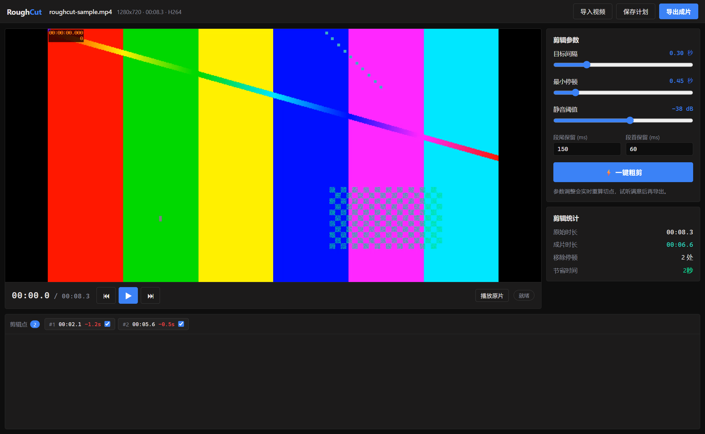

# RoughCut · 粗剪

**口播视频一键粗剪**——自动检测每一处停顿，把它们统一收紧到你指定的间隔（0.2 秒 / 0.3 秒 / 0.5 秒，节奏由你定），逐切点试听、整片预览、导出，收工。

[English docs →](README.md)



## 为什么做这个

用提词器录口播，停顿注定长短不一：有的短、有的长、有的是"脑子当机"的两三秒。剪映等工具的智能剪辑对语音间隔识别不准，也没法精确控制剪完的间隔时长——最后还是得盯着波形一刀一刀剪，五分钟素材几十上百个停顿，纯体力活。

RoughCut 只做一件事并做准：**让口播里每一处停顿变成你想要的精确时长**，直接基于音频波形完成。导出的成片作为新的原始素材进剪映做二次创作（字幕、BGM、贴纸、调色）。

## 功能

- ⚡ **一键收紧**——基于音频 RMS 能量检测停顿，长于目标间隔的停顿全部精确收缩到目标值
- 🎛️ **节奏参数化**——目标间隔、最小停顿、静音阈值、段首/段尾保留全部可调；改参数即时重算，无需重新分析
- 👂 **导出前试听**——点击任意切点试听"剪完后的衔接效果"（切点前后各 1.2 秒）；**无需导出**即可把整片按剪辑计划无缝快速听一遍（Web Audio 采样级拼接）
- ✅ **切点可否决**——检测误切了某处？单独取消勾选那一个切点，其余不受影响
- 📤 **干净的导出**——H.264 MP4（CRF 可调）+ 可选纯音频 WAV + 记录每一刀的 JSON 剪辑报告
- 🖥️ **GUI + 命令行共用一套引擎**——桌面端负责试听审查流，CLI 负责脚本化批处理；两端共享同一份剪辑计划 JSON 契约
- 🔌 **无云端、无模型**——纯信号能量分析 + FFmpeg，快且完全离线

## 环境要求

- **Node.js ≥ 20**
- **FFmpeg** 在 `PATH` 中（或设 `ROUGHCUT_FFMPEG` 环境变量指向 ffmpeg 程序或其目录）
  - Windows：`winget install Gyan.FFmpeg` 或 `scoop install ffmpeg`
  - macOS：`brew install ffmpeg` · Linux：发行版包管理器

## 快速开始

```bash
git clone https://github.com/YOUR_NAME/roughcut.git
cd roughcut
npm install
npm run build
```

### 桌面端（Windows 优先，Electron）

```bash
npm run dev:desktop
```

导入视频（按钮或拖拽）→ 调目标间隔 → 试听切点（`空格` = 紧凑预览，`Alt+←/→` = 上/下一切点）→ 导出成片。

> HEVC/H.265 素材会自动生成 H.264 代理用于画面预览；分析、试听与导出始终使用原始文件。
> 中国网络安装 Electron 慢时：`set ELECTRON_MIRROR=https://npmmirror.com/mirrors/electron/` 后再 `npm install`。

### 命令行

```bash
# 先看看会剪哪些地方
node packages/cli/bin/roughcut.js analyze input.mp4 --target-gap 0.3

# 直接剪
node packages/cli/bin/roughcut.js cut input.mp4 -o output.mp4 --audio output.wav

# 全 JSON 工作流
node packages/cli/bin/roughcut.js analyze input.mp4 --json > plan.json
# ……手工把误切切点的 "enabled" 改成 false ……
node packages/cli/bin/roughcut.js cut input.mp4 -o output.mp4 --plan plan.json
```

`npm link -w @roughcut/cli` 之后可直接使用 `roughcut` 命令。

常用参数（括号内为默认值）：`--target-gap 0.3`（剪完后的停顿时长）· `--min-silence 0.45`（短于此不动）· `--threshold -38`（静音阈值 dBFS，可写 `--threshold=-38`）· `--pad-before 0.06` / `--pad-after 0.15`（防切字头/字尾）· `--crf 18` · `--dry-run` · `--json`

## 工作原理

1. FFmpeg 把音轨解码为 16 kHz 单声道 PCM，计算短时 RMS（20ms 窗 / 10ms 步进）和波形峰值——检测与可视化用同一份数据，**所见即所剪**。
2. 低于阈值且长于"最小停顿"的静音段判定为停顿；长于"目标间隔"的停顿生成一刀，剪完恰好留下目标间隔长度的**原片底噪**（其中至少"段尾保留"贴上一句、至少"段首保留"贴下一句——不插数字静音、不切字）。
3. 保留段用 FFmpeg `trim/atrim + concat` 滤镜图一次重编码拼接（毫秒级精确）；滤镜图走脚本文件传入，Windows 上几百个切点也没问题。
4. 剪辑报告 JSON（与计划同构）记录每处停顿、每刀区间和前后时长。

技术细节见 [docs/DESIGN.md](docs/DESIGN.md)，产品论证见 [docs/PRD.md](docs/PRD.md)。

## 开发

```
packages/core     引擎：探测 / 分析 / 检测 / 计划 / 导出（零运行时依赖）
packages/cli      roughcut 命令行（零依赖，调用 core）
apps/desktop      Electron + React 桌面端（electron-vite）
```

```bash
npm test          # core 单元测试（Vitest）
npm run test:e2e  # CLI 端到端（合成媒体，需要 ffmpeg）
npm run dev:desktop
npm run typecheck
```

GUI 冒烟测试（自动导入素材、等待分析完成、截图退出）：

```bash
node scripts/make-sample.mjs sample.mp4
cd apps/desktop && npm run build && npx electron . --smoke ../../sample.mp4
```

路线图见 [docs/STATUS.md](docs/STATUS.md)。欢迎贡献——见 [CONTRIBUTING.md](CONTRIBUTING.md)。

## 许可

[MIT](LICENSE)。FFmpeg 为用户自行安装的独立运行时依赖，遵循其自身许可协议。
